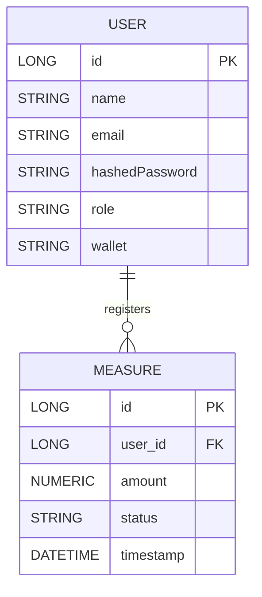

# 🗂️ Waternet Entity-Relationship Diagram (ERD)

ERD representing the main entities and their relationships in the Waternet backend.

---

## **Entities**

### **User**
- `id`: Long (PK)
- `name`: String
- `email`: String (unique)
- `hashedPassword`: String
- `role`: Enum (USER, SUPERVISOR)
- `wallet`: String (Ethereum address)

### **Measure**
- `id`: Long (PK)
- `user_id`: Long (FK → User)
- `amount`: Numeric (e.g., measured value)
- `status`: Enum (PENDING, APPROVED, REJECTED)
- `timestamp`: DateTime
- *(other fields as needed)*

### **Supervisor**
- No separate entity — users with role `SUPERVISOR`

---

## **Relationships**

- **User** (1) --- (*) **Measure**
    - A user can register multiple measures.
    - Each measure belongs to a single user.
- **Supervisor** actions are tracked via `status` changes and are not a separate table/entity.

---

## **ERD**

---

## **Notes**
- The **User** table holds all users, distinguished by the `role` field.
- The **Measure** table stores submissions linked to a user and their approval status.
- Additional entities (for tokens, transactions, etc.) are handled via blockchain and not done in the SQL database.
- The in-memory H2 database is used for development; a production deployment would require a persistent RDBMS.

---