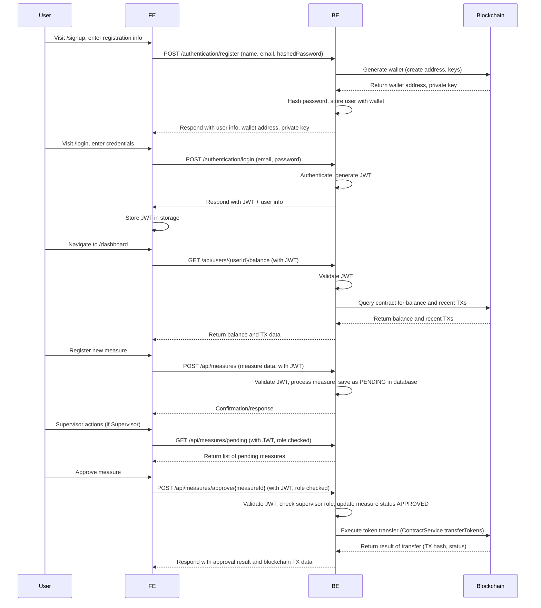

# 🌊 Waternet: Flow from Frontend to Backend

This flowchart outlines the architectural flow from the frontend to the backend, including routing, services, authentication, controllers, and important backend integrations.

---

## 1. **Frontend (Vue.js)**

### a. **Routing & Access Control**
- Uses Vue Router to define pages: Home, Dashboard, RegisterMeasure, SupervisorPanel, Wallet, Login, Signup.
- Navigation guards check **authentication** and **user roles** (USER/SUPERVISOR) before allowing access to certain routes.
  - If not authenticated, user is redirected to `/` or `/login`.
  - Supervisors and users have access to different panels.

### b. **Session & Authentication**
- `SessionService` manages login (`/authentication/login`), registration (`/authentication/register`), token storage (JWT), and session state.
- On login:
  - Sends POST request to `/authentication/login` with email & password.
  - On success, stores JWT from `Authorization` header and user info in local/session storage.
- On registration:
  - Sends POST to `/authentication/register` with name, email, and hashed password.
  - Receives user object (with wallet address) and private key.

### c. **API Services**
- **UserBalanceService**: Gets user balance from `/api/users/{id}/balance`.
- **MeasureService**: Handles measure registration, data fetch, and queries via `/api/measures` endpoints.
- **AxiosInstance**: Attaches JWT from storage to every request as a Bearer token.

---

## 2. **Backend (Spring Boot + Kotlin)**

### a. **Controllers**
- **AuthenticationController** (`/authentication`)
  - `POST /login`: Authenticates user credentials, returns user info and JWT token.
  - `POST /register`: Registers new user, creates Ethereum wallet using Web3j, hashes password, stores user.
- **UserController** (`/api/users`)
  - `GET /{id}`: Returns user info.
  - `GET /{id}/balance`: Calls blockchain contract via `ContractService` to get user's token balance.
- **MeasureController** (implied: `/api/measures`)
  - `POST /approve/{measureId}`: Supervisor approves a measure, triggers token transfer on blockchain.

### b. **Authentication & Authorization**
- Uses JWT tokens, checked on every protected endpoint.
- User roles (`USER`, `SUPERVISOR`) are enforced on both FE (router) and BE (controller security).
- Passwords are hashed before storage.

### c. **Blockchain Integration**
- Backend uses Web3j to interact with Ethereum smart contracts.
- On user registration, a wallet is generated and stored.
- Token operations (balance, mint, transfer) handled via `ContractService`.
- RPC configuration with Infura
- Smartcontract and admin private key security configuration

### d. **Database**
- In-memory H2 database for user, measure, and other records.
- H2 console is accessible for local debugging.

--

## 3. **Flowchart: User<>FE<>BE<>Blockchain**

---

## 4. **Key Components in Code**

- **Frontend:**
  - `src/router/index.js` (routing, guards)
  - `src/services/SessionService.js` (auth/session)
  - `src/services/AxiosInstance.js` (JWT token handling)
  - `src/services/UserBalanceService.js`, `src/services/MeasureService.js`
  - `src/components/SupervisorPanel.vue` (supervisor actions)
- **Backend:**
  - `rest/AuthenticationController.kt`, `rest/UserController.kt`, `rest/MeasureController.kt`
  - `sepolia/ContractService.kt` (blockchain logic)
  - `SecurityConfig.kt`, `CorsConfig.kt`, `APIConfig.kt`, `filters/JWTRequestFilter` for JWT validation
  - `sepolia/Web3jConfig.kt`, `sepolia/AdminWalletConfig.kt`, `seplia/HydRewards.java` Blockchain RPC endpoint and contract configuration

---

## 5. **Summary Table**

| Layer      | Main Components                       | Purpose                                    |
|------------|--------------------------------------|--------------------------------------------|
| Frontend   | Vue Router, SessionService, Axios    | Routing, UI, Auth, API calls               |
| Backend    | AuthController, UserController, MeasureController | Handle login, registration, data, security, supervisor actions |
| Blockchain | ContractService, Web3j, HydRewards                | Token minting, balance, transfer           |
| Database   | H2 (in-memory)                       | Store users, measures, etc.                |

---